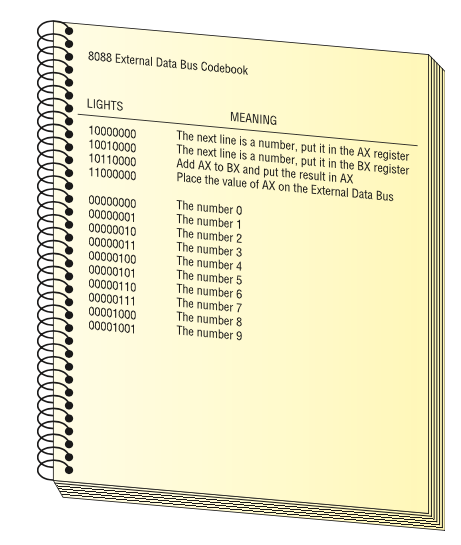

# Question 1

Perform the following binary additions: 

1. 101 + 11 = 

2. 111 + 111 =

3. 1010 + 1010 =

4. 11101 + 1010 =

5. 11111 + 11111 =

::: {.callout-tip icon="false" collapse="true"}
## Solution 

1. 1000

2. 1110

3. 10100

4. 100111

5. 111110

::: 

# Question 2
Convert the following numbers to binary and perform the operation:

1. (32)~10~ =

2. (50)~10~ + (32)~10~ = 

3. (64)~10~ + (4)~10~ =

4. (100)~10~ + (220)~10~ =

::: {.callout-tip icon="false" collapse="true"}
## Solution 

1.     10 0000

2.    101 0010

3.    100 0100

4. 1 0100 0000

::: 

# Question 3
Given the codebook below, write the binary instructions to perform this operation: 
(100)~10~ + (220)~10~ .

- What's the final value on the External Data Bus?

::: {.callout-tip icon="false" collapse="true"}
## Solution 

1. 1000 0000 (The next line is a number, put it in the AX register)

2. 0110 0100 (The number 100)

3. 1001 0000 (The next line is a number, put it in the BX register)

4. 1101 1100 (The number 220)

5. 1011 0000 (Add AX to BX and put the results in AX)

6. 1100 0000 (PLace the value of AX on the External Data Bus)

0110 0100 + 11011100 = ~~1~~ 0100 0000

Since the CPU's bus size is limited to 8 bits, the most significant bit (left most, or highest power) will be lost. 

The final answer on the ESD is:  **01000000**  = (64)

::: 

# Question 4
What is -230 in two's complement representation with an 12 bits bus width? 

::: {.callout-tip icon="false" collapse="true"}
## Solution 

1. Write 230 in binary: 

> 1110 0110

2. Complete the number of bits to 12 and add a bit for the sign: 

> **0**000 1110 0110

3. Flip the bits (one's complement):

> **1**111 0001 1001

4. Add 1 to get two's complement: 

> **1**111 0001 1010

::: 

# Question 5
Convert the following numbers to binary and perform the operation on an 8-bit CPU:

1. (50)~10~ - (32)~10~ = 

2. (64)~10~ - (4)~10~ =

3. (100)~10~ - (120)~10~ =

::: {.callout-tip icon="false" collapse="true"}
## Solution 
1. (50)~10~ - (32)~10~ = (50)~10~ + (-32)~10~

Binary 50: 

> **0**011 0010

Binary 32: 

> **0**010 0000

Invert 32: 

> **1**101 1111

Add 1:     

> **1**110 0000

Operation: 50-32 :

> **0**011 0010
> \+
> **1**110 0000
> =
> **0**001 0010

2. (64)~10~ - (4)~10~ = (64)~10~ + (-4)~10~

Binary 64: 

> **0**100 0000

Binary 4: 

> **0**000 0100

Invert 4: 

> **1**111 1011

Add 1:     

> **1**111 1100

Operation: 64-4 :

> **0**100 0000
> \+
> **1**111 1100
> =
> **0**011 1100

3. (100)~10~ - (120)~10~ = (100)~10~ + (-120)~10~

Binary 100: 

> **0**110 0100

Binary 120: 

> **0**111 1000

Invert 120: 

> **1**000 0111

Add 1:     

> **1**000 1000

Operation: 100-120 :

> **0**110 0100
> \+
> **1**000 1000
> =
> **1**110 1100  = (-20)~10~
::: 