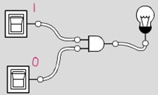
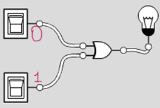
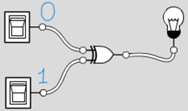
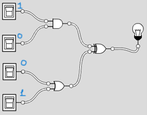
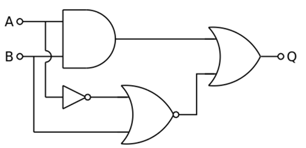
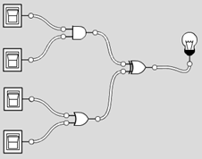
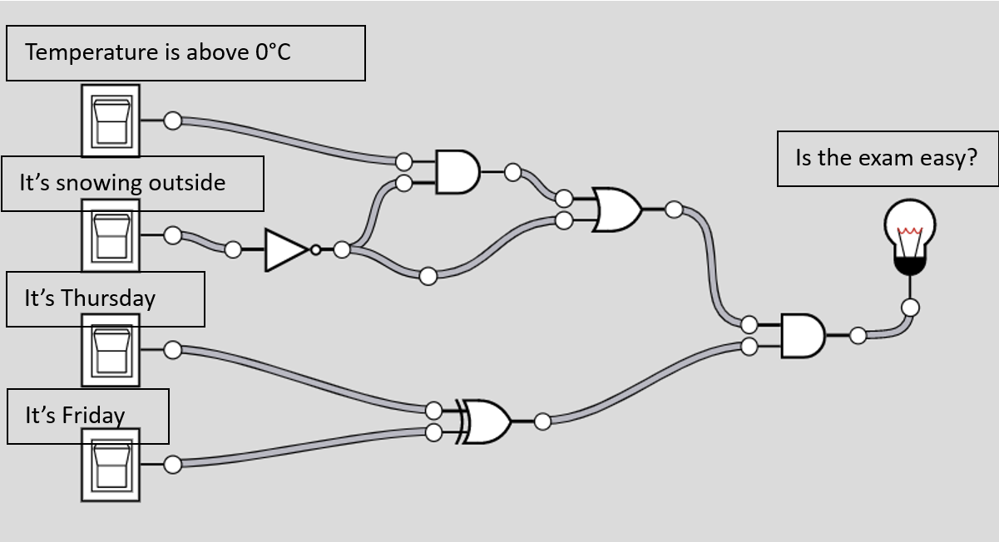

# Short Questions

Generated from the notes with the help of Claude AI:

1. In a half-adder, what does the Carry represent?

2. What are the Sum and Carry outputs when A = 1 and B = 1?

3. What is the main limitation of a half-adder, and how does a full-adder address it?

4. How many inputs and outputs does a full-adder have, and what are they?

5. What are the Sum and Carry of a full-adder if all three inputs are 1?

::: {.callout-tip icon="false" collapse="true"}
## Solution
1. The Carry is the new power of 2 that carries over to the next position.

2. When A = 1 and B = 1, the Sum is 0 and the Carry is 1 (1 + 1 = 10 in binary).

3. A half-adder doesn't account for a Carry coming from a previous addition. When adding multi-bit numbers, each position must include the carry from the lower position, which a half-adder can't take as an input.

4. A full-adder has 3 inputs (A, B and the Carry-in) and 2 outputs (Sum and Carry-out).

5. If all three inputs are 1, then 1 + 1 + 1 = 3 = 11 in binary, so the Sum is 1 and the Carry is 1.

:::

# 1. Logic gates 

On the left is the input to a series of logical circuits.  

Indicate the resulting output on the right (1 = on, 0 = off) as well as the intermediate binary values at the exit of each gate:

 Logic Gates |Output (1 or 0)?|
-------------|----------------|  
|{width=200}       |
|{width=200}        |
|{width=200}        |
|{width=200}        |

::: {.callout-tip icon="false" collapse="true"}
## Solution

| Circuit      | 1 (on) or 0 (off)? |
| -------------| ------------------ |
| 1            | 0                  |
| 2            | 1                  |
| 3            | 1                  |
| 4            | 1                  |

Note: For circuit 4, the exit of the AND gate is 0 and the exit of the OR gate is 1.

::: 

# 2. Truth table 2 inputs:

Complete the truth table of the following logic circuit and provide the intermediate values at the exit of each gate: 

::: {.callout-tip icon="false" collapse="true"}
## Solution

Truth table 2 inputs 1 output:

| **A** | **B** | **AND (A, B)** |**NOT (A)**| **NOR (NOT A, B)** |**OR(AND, NOR)**| **Output** |
| :---: | :---: | :-------------:| :-------: | :----------------: |:--------------:| :--------: |
| **0** | **0** | **0**          | **1**     | **0**              | **0**          | **0**      |
| **1** | **0** | **0**          | **0**     | **1**              | **1**          | **1**      |
| **0** | **1** | **0**          | **1**     | **0**              | **0**          | **0**      |
| **1** | **1** | **1**          | **0**     | **0**              | **1**          | **1**      |       

 

:::

# 3.  Truth table 4 inputs: 

Complete the truth table of the following logic circuit: 

| **Input 1** | **Input 2** | **Input 3** | **Input4** | **Output** |
| ----------- | ----------- | ----------- | ---------- | ---------- |
|             |             |             |            |            |
|             |             |             |            |            |
|             |             |             |            |            |
|             |             |             |            |            |

::: {.callout-tip icon="false" collapse="true"}
## Solution

| **Input 1** | **Input 2** | **Input 3** | **Input4** | **Output** |
| ----------- | ----------- | ----------- | ---------- | ---------- |
| **0**       | **0**       | **0**       | **0**      | **0**      |
| **0**       | **1**       | **0**       | **0**      | **0**      |
| **1**       | **0**       | **0**       | **0**      | **0**      |
| **1**       | **1**       | **0**       | **0**      | **1**      |
| **0**       | **0**       | **1**       | **1**      | **1**      |
| **0**       | **1**       | **1**       | **1**      | **1**      |
| **1**       | **0**       | **1**       | **1**      | **1**      |
| **1**       | **1**       | **1**       | **1**      | **0**      |
| **0**       | **0**       | **1**       | **0**      | **1**      |
| **0**       | **1**       | **1**       | **0**      | **1**      |
| **1**       | **0**       | **1**       | **0**      | **1**      |
| **1**       | **1**       | **1**       | **0**      | **0**      |
| **0**       | **0**       | **0**       | **1**      | **1**      |
| **0**       | **1**       | **0**       | **1**      | **1**      |
| **1**       | **0**       | **0**       | **1**      | **1**      |
| **1**       | **1**       | **0**       | **1**      | **0**      |

 
:::

# 4. Half adders and Full adders

We have seen the half adder logical circuit in class, but we haven’t actually seen why it’s called a half adder. Consider this, if you are trying to add two numbers in a row such as 1 +1 +1. If you try putting two half adder circuits in a row, you will have a problem! 
The output of one gate would have a sum and a carry, we need to have three inputs in the following gate to perform the following addition! That’s when the full comes in handy:

Fill out the truth table of the full adder:

| **A** | **B** | **Cin** | **S** | **Cout** |
| ----- | ----- | ------- | ----- | -------- |
|       |       |         |       |          |
|       |       |         |       |          |
|       |       |         |       |          |
|       |       |         |       |          |
|       |       |         |       |          |
|       |       |         |       |          |
|       |       |         |       |          |

::: {.callout-tip icon="false" collapse="true"}
## Solution

Full Adder Truth Table:

| **A** | **B** | **Cin** | **S** | **Cout** |
| ----- | ----- | ------- | ----- | -------- |
| 0     | 0     | 0       | 0     | 0        |
| 0     | 0     | 1       | 1     | 0        |
| 0     | 1     | 0       | 1     | 0        |
| 0     | 1     | 1       | 0     | 1        |
| 1     | 0     | 0       | 1     | 0        |
| 1     | 0     | 1       | 0     | 1        |
| 1     | 1     | 0       | 0     | 1        |
| 1     | 1     | 1       | 1     | 1        |

:::

# 5. Exam easy or hard?
The first section of students of Tech Support collectively decided not to study for their mid-term exam and instead build a truth table to predict if the exam will be easy or hard based on their teacher’s mood. 

They built a logic gate diagram, where the output is a light bulb. If it turns on, the exam will be easy, and everyone passes.

They have four switches that can turn on/off independently. The first switch represents if the weather is above 0 degrees Celsius in Canada. The second switch represents if it’s snowing outside (negative temperatures). The third switch represents if the exam is happening on a Thursday and the last switch represents if the exam is happening on a Friday.  

1. Let’s imagine it is snowing on Exam Day. Build a truth table.

> Hint: Observe the inputs and the gates well. You do not need to try all possibilities. 

| The temperature is above  0 ° C ? | It is a Thursday? | It is a Friday? | Exam is easy? |
| --------------------------------- | ----------------- | --------------- | ------------- |
|                                   |                   |                 |               |
|                                   |                   |                 |               |
|                                   |                   |                 |               |
|                                   |                   |                 |               |
|                                   |                   |                 |               |
|                                   |                   |                 |               |
|                                   |                   |                 |               |
|                                   |                   |                 |               |

2. Let’s imagine it is not snowing on the Exam Day. Build a truth table for all possibilities. 

| The temperature is above  0 ° C? | It is a Thursday? | It is a Friday? | Exam is easy or not? |
| -------------------------------- | ----------------- | --------------- | -------------------- |
|                                  |                   |                 |                      |
|                                  |                   |                 |                      |
|                                  |                   |                 |                      |
|                                  |                   |                 |                      |
|                                  |                   |                 |                      |
|                                  |                   |                 |                      |
|                                  |                   |                 |                      |
|                                  |                   |                 |                      |

3. One of the inputs seems to not affect the output, which one is it?

4. Simplify the logic circuit be removing this gate. 

